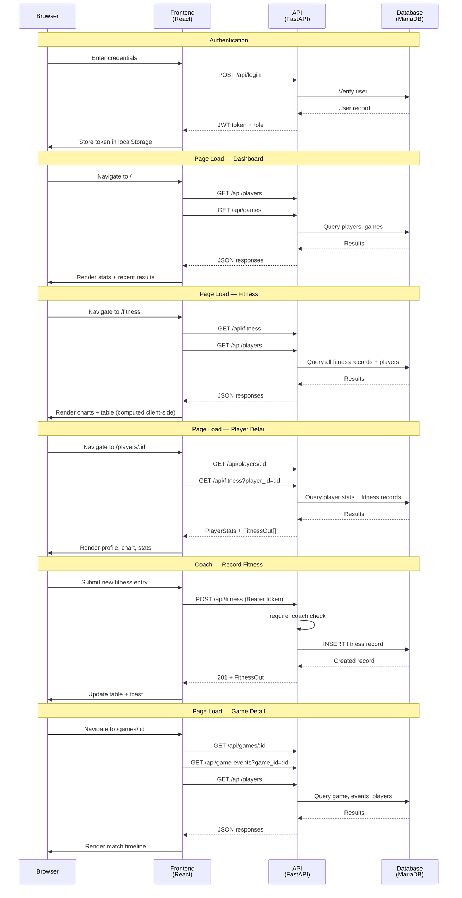

# ⚡ Thornleigh Thunder U14 D3

Welcome to the official team hub for **Thornleigh Thunder Under 14 Division 3** — a simple, friendly place for parents, players, and the coach to follow the season together. 🏆⚽

Visit the site 👉 **[ttu14.com](https://ttu14.com)**

---

## 👋 What is this?

This website is the season-long home of our Under 14 Division 3 squad. Parents can check upcoming and past fixtures, see how the team is doing, track each player's stats, and peek at the coach's formations — all in one place, on any device.

There are two kinds of accounts:

- 👨‍👩‍👧 **Parent** — can view everything (players, games, formations, fitness, stats)
- 👟 **Coach** — can do all of the above, plus add games, record match events, update formations, and log fitness results

Ask the coach for login details if you don't have them yet.

---

## Features

### 🏠 Home / Dashboard

The landing page gives a quick overview of the season:

- Season record: played, wins, draws, losses, and win percentage
- Recent match results with scores and venues

### 🧍 Players

The **Players** page shows every player on the squad with their shirt number and playing position.

Click any player to open their profile and see:

- ⚽ **Goals & Assists** across the season
- 🟨 🟥 **Cards** received
- 💪 **Fitness history** with a trend chart from regular beep tests
- 📋 **Primary and secondary positions** (e.g. RW / RM → *Right Winger / Right Midfielder*)
- 📊 **Fitness grade** (A+ through F) derived from the latest beep test score

This is a great place to celebrate your child's progress and see how they're developing through the season.

### 💪 Fitness

The **Fitness** page gives a team-wide view of beep test results:

- 🍕 **Grade Distribution** — donut chart showing how many players fall into each grade (A+ through F)
- 📈 **Team Fitness Trend Over Time** — line chart tracking the team's average score across test dates
- 📋 **Player Results** — sortable table showing each player's latest score, grade, trend indicator (▲ Up / ■ Same / ▼ Down), and percentage change from their previous test
- ❓ **"What do these levels mean?"** — modal explaining the grade scale

### 🧩 Formations

The **Formations** page is an interactive football pitch where the coach plans how the team will line up for a match.

- 🎯 Players can be dragged anywhere on the pitch to match the chosen shape (e.g. 4-4-2, 4-3-3)
- 🪑 A reserves area shows who's on the bench
- 👀 Parents can view the current formation — a handy way to see where your child will be playing before kickoff

### 🗓️ Games

The **Games** page lists every fixture for the season — past and upcoming.

Each game shows:

- 📅 Date and venue
- 🏠 / 🚌 Home or Away
- 🔢 Final score (once played)
- ☀️ 🌧️ Weather conditions on the day
- 🌱 Pitch condition

Click a game to open its **match details**, where you'll find the full timeline of events — who scored ⚽, who assisted 👟, any yellow 🟨 or red 🟥 cards, and goals conceded from the opposing team, all with the minute they happened.

---

## Tech Stack

| Layer | Technology |
|-------|-----------|
| Frontend | React + Vite + Tailwind CSS |
| Backend | FastAPI + SQLAlchemy + Pydantic |
| Database | MariaDB (production) / SQLite (dev) |
| Auth | JWT (Bearer token) |
| Charts | Recharts |
| Tables | TanStack Table |
| Hosting | Vercel (frontend) + AWS EC2 (backend) |
| DNS/SSL | Cloudflare |

---

## API Sequence Diagram

---

## 📱 Works on any device

The site is designed to work nicely on phones, tablets, and computers — no app to install. Just open [ttu14.com](https://ttu14.com) in your browser and log in.

---

## 📧 Contact & Support

Spotted something wrong? Have a question or a suggestion?

Reach out to **fga294@gmail.com** and we'll help you out. 🙌

---

*Go Thunder!* ⚡💙💛
